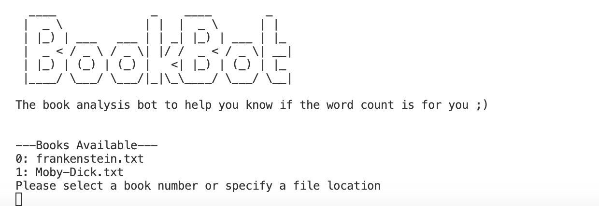

# BookBot

BookBot is a text analysis project that helps you understand the text by providing word count and character counts.

## Features

- Count the number of words in a text file.
- Count the occurrences of each character in a text file.
- Generate a detailed report of the analysis.

## Usage

1. Place the text files you want to analyze in the `Books` directory or specify the `path` to your text
2. Run the `main.py` script:
    ```sh
    python main.py
    ```
3. Follow the on-screen instructions to select the book you want to analyze.

## Example

Here is an example of how to use BookBot:

1. Run the script:
    ```sh
    python main.py
    ```
2. You will see a prompt to select a book; follow said prompts


3. BookBot will generate a report similar to the following:
    ```
    --- Begin report of [frankenstein.txt](http://_vscodecontentref_/1) ---
    78456 words found in the document

    The 'a' character was found 4567 times
    The 'b' character was found 1234 times
    ...
    --- End report ---
    ```


